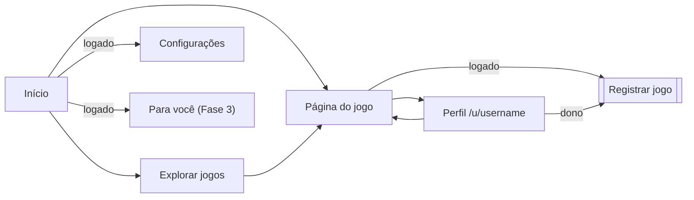

# 02 · Telas e abas

O front-end fica em outro repositório (esqueleto em [08 · Front-end](08-frontend.md)). Esta é a lista de telas que a API precisa atender; os endpoints estão detalhados em [04 · API](04-api.md).

## Navegação

## Telas públicas

| Tela | Rota no front | O que mostra | Endpoints | Fase |
|---|---|---|---|---|
| Início | `/` | Jogos mais adicionados na semana e avaliações recentes; logado, atalho para "Jogando" e (Fase 3) "Você poderá gostar" | `GET /games?sort=trending`, `GET /reviews` | 1 |
| Explorar | `/games` | Busca por nome com filtros (gênero, plataforma, ano) e ordenação | `GET /games`, `GET /genres`, `GET /platforms` | 1 |
| Página do jogo | `/games/:slug` | Capa, dados, números da comunidade, avaliações (mais recentes ou mais curtidas, com os botões de curtir e de denunciar), botão "Adicionar" com escolha de status; (Fase 3) "Jogos parecidos" | `GET /games/{slug}`, `GET /games/{slug}/reviews`, `GET /me/library/{gameId}` se logado, `GET /games/{slug}/similar` | 1 |
| Perfil | `/u/:username` | Cabeçalho e abas (abaixo) | `GET /users/{username}` e as rotas de cada aba | 1 |
| Entrar / Criar conta | `/login`, `/signup` | Formulários | `POST /auth/login`, `POST /auth/register` | 1 |
| Recuperar senha | `/forgot-password`, `/reset-password` | Formulários | `POST /auth/password/forgot`, `POST /auth/password/reset` | 2 |

## Abas do perfil

**Cabeçalho:** nome, @username, bio, gênero (se informado), "membro desde" e contadores (jogados, jogando, quero jogar, desejos, favoritos, avaliações). Seguidores e seguidos levam às listas, e quem visita tem o botão Seguir.

| Aba | Conteúdo | Endpoint | Fase |
|---|---|---|---|
| Visão geral | Favoritos em destaque, jogando agora, atividade recente e resumo das estatísticas | `GET /users/{u}`, `GET /users/{u}/library` (favoritos, jogando e os últimos atualizados), `GET /users/{u}/stats` | 1 |
| Jogados | Jogados e abandonados, com filtro "Todos / Zerados / Abandonados" | `GET /users/{u}/library?status=PLAYED,DROPPED` | 1 |
| Jogando | Jogos em andamento | `GET /users/{u}/library?status=PLAYING` | 1 |
| Quero jogar | Backlog | `GET /users/{u}/library?status=BACKLOG` | 1 |
| Lista de desejos | O que quer comprar | `GET /users/{u}/library?status=WISHLIST` | 1 |
| Favoritos | Jogos marcados como favoritos | `GET /users/{u}/library?favorite=true` | 1 |
| Avaliações | Só entradas com texto; spoiler escondido até clicar; curtidas | `GET /users/{u}/reviews` | 1 |
| Estatísticas | Gráficos por ano, gênero, plataforma, notas e horas; gastos, se o dono permitir | `GET /users/{u}/stats` | 1 |
| Seguidores e seguidos | Fora da faixa de abas: abrem pelos contadores do cabeçalho | `GET /users/{u}/followers`, `GET /users/{u}/following` | 2 |
| Listas | Listas personalizadas, com um mosaico das capas; a dona cria a partir do título. Cada lista tem página própria (`/u/:username/lists/:listId`), onde a dona edita título, descrição, privacidade, jogos, ordem e notas | `GET /users/{u}/lists`, `GET /users/{u}/lists/{id}` | 2 |

Todas as abas de jogos usam o mesmo componente: uma grade de capas com nota, ícone de "recomenda" e de favorito, filtros (gênero, plataforma, nota), ordenação e paginação.

Quando o dono abre o próprio perfil, o front usa `GET /me/profile`, `GET /me/library` e `GET /me/reviews`, que valem com o perfil privado e incluem loja e valor pago, e mostra os botões de editar. Assim, as rotas públicas devolvem a mesma resposta para qualquer pessoa.

## Telas logadas

| Tela | O que tem | Endpoints | Fase |
|---|---|---|---|
| Registrar jogo (modal) | Seções **Status**, **Avaliação** (nota, recomenda, texto, spoiler), **Jogatina** (plataforma, horas, datas, zerou), **Aquisição** (forma, loja, valor, moeda, data) e **Favorito**. Cada campo só aparece nos status em que é permitido ([RN02](01-requisitos.md#regras-de-negócio)) | `PUT /me/library/{gameId}`, `DELETE /me/library/{gameId}`, `GET /stores`, `GET /platforms` | 1 |
| Configurações | Abas **Perfil** (nome, bio, gênero, username), **Conta** (e-mail, senha), **Privacidade** (perfil privado, mostrar gastos, moeda) e **Dados** (exportar na Fase 2, excluir conta) | `GET /me`, `PATCH /me`, `PATCH /me/settings`, `PUT /me/password`, `DELETE /me` | 1 |
| Feed | Atividade de quem eu sigo, em frases como "Bia zerou Hollow Knight · há 2 horas"; avaliações com nota, recomendação e spoiler escondido | `GET /me/feed` | 2 |
| Para você | Sugestões com motivo e os botões "não tenho interesse" e "já joguei" | `GET /me/recommendations`, `POST /me/recommendations/feedback` | 3 |
| Primeiros passos | "Escolha 5 jogos que você ama", logo após o cadastro | `GET /games`, `PUT /me/library/{gameId}` | 3 |

## Administração

A moderação de denúncias tem tela desde a 2.4 (`/admin/reports`); o catálogo ainda tem só os endpoints.

| Tela | Endpoints |
|---|---|
| Catálogo: importar pelo id do IGDB, ressincronizar, corrigir dados | `POST /admin/games/import`, `POST /admin/games/{id}/sync`, `PATCH /admin/games/{id}` |
| Denúncias (`/admin/reports`): as avaliações denunciadas, as mais denunciadas primeiro, com "Manter" e "Remover texto" | `GET /admin/reports`, `PATCH /admin/reports/{id}` |

## Estados que toda tela precisa ter

- **Carregando:** skeleton das capas.
- **Vazio:** mensagem e ação ("Nada em Quero jogar ainda. Explore jogos").
- **Erro:** mensagem e opção de tentar de novo.
- **Perfil privado:** cabeçalho com o aviso "Este perfil é privado".
- **Não encontrado:** página 404 para jogo ou usuário inexistente.
