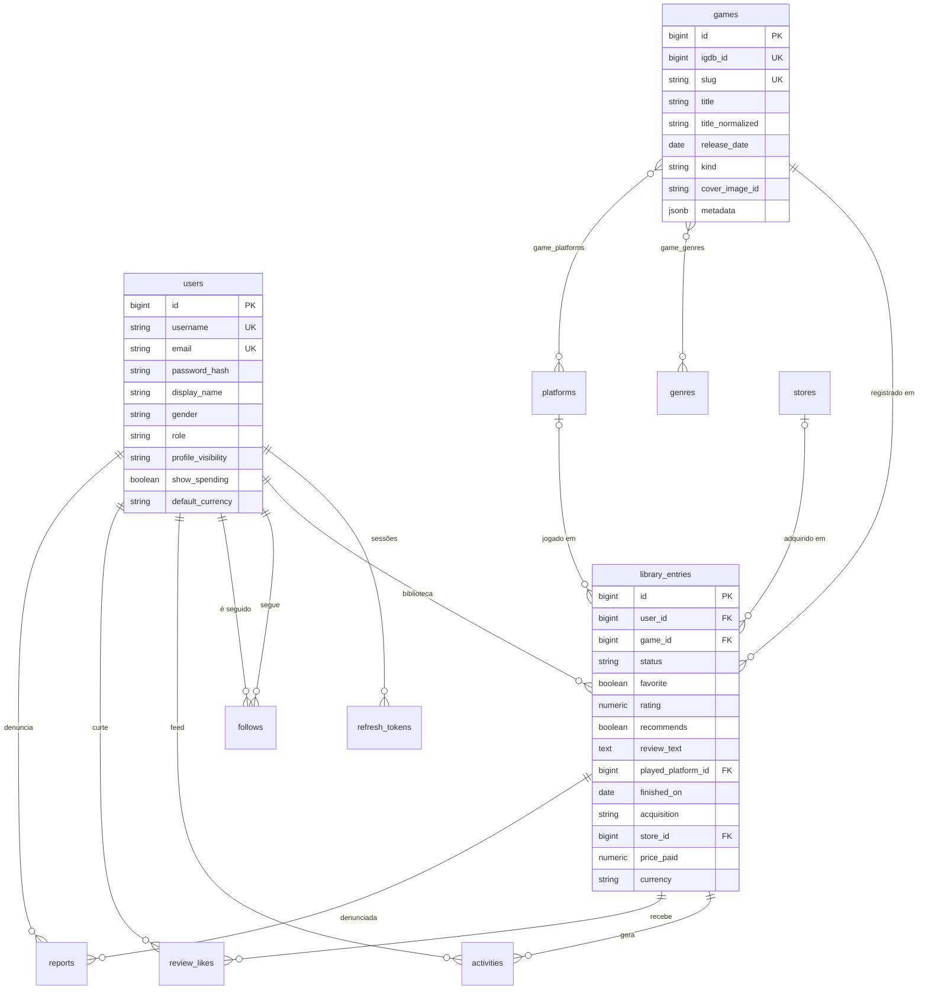

# 03 · Modelo de dados

PostgreSQL. Tabelas no plural, em snake_case e sem prefixo `tb_`. O schema nasce e evolui por migrations do Flyway.

## Diagrama

## Tabelas do MVP

### `users`

| Coluna | Tipo | Regras |
|---|---|---|
| `id` | bigint identity | PK |
| `username` | varchar(20) | único, sempre minúsculo ([RN08](01-requisitos.md#regras-de-negócio)) |
| `email` | varchar(254) | único, sempre minúsculo |
| `password_hash` | varchar(100) | hash BCrypt |
| `display_name` | varchar(50) | opcional |
| `bio` | varchar(300) | opcional |
| `gender` | varchar(12) | opcional: `FEMALE`, `MALE`, `NON_BINARY`, `OTHER`; `null` = não informado ([RN14](01-requisitos.md#regras-de-negócio)) |
| `role` | varchar(10) | `USER` ou `ADMIN`; padrão `USER` |
| `profile_visibility` | varchar(10) | `PUBLIC` ou `PRIVATE`; padrão `PUBLIC` |
| `show_spending` | boolean | padrão `false` |
| `default_currency` | char(3) | padrão `BRL` |
| `created_at`, `updated_at` | timestamptz | |

### `refresh_tokens`

| Coluna | Tipo | Regras |
|---|---|---|
| `id` | bigint identity | PK |
| `user_id` | bigint | FK `users`, `ON DELETE CASCADE` |
| `token_hash` | char(64) | SHA-256 do token (o token em si nunca é salvo); único |
| `family_id` | uuid | o mesmo em todas as rotações de uma sessão |
| `expires_at` | timestamptz | |
| `revoked_at` | timestamptz | `null` = ativo |
| `created_at` | timestamptz | |

### `games`

| Coluna | Tipo | Regras |
|---|---|---|
| `id` | bigint identity | PK |
| `igdb_id` | bigint | único; `null` para jogo criado à mão |
| `slug` | varchar(150) | único; usado na URL |
| `title` | varchar(255) | |
| `title_normalized` | varchar(255) | título em minúsculas e sem acento, para a busca |
| `summary` | text | |
| `release_date` | date | `null` se ainda não lançou |
| `kind` | varchar(20) | `MAIN`, `REMAKE`, `REMASTER`, `EXPANSION`, `STANDALONE`... |
| `cover_image_id` | varchar(50) | id da imagem no IGDB; a URL é montada na resposta |
| `metadata` | jsonb | temas, palavras-chave, modos, perspectiva, desenvolvedoras, publicadoras, franquia, `similar_games` |
| `igdb_rating` | numeric(5,2) | 0 a 100 |
| `igdb_rating_count` | integer | ajuda a ordenar por popularidade enquanto o site tem pouco uso |
| `synced_at` | timestamptz | última sincronização com o IGDB |
| `created_at`, `updated_at` | timestamptz | |

### Tabelas auxiliares

| Tabela | Colunas | Observação |
|---|---|---|
| `genres` | `id`, `igdb_id` (único), `name`, `slug` (único) | vêm do IGDB |
| `platforms` | `id`, `igdb_id` (único), `name`, `abbreviation`, `slug` (único) | vêm do IGDB |
| `game_genres` | `game_id`, `genre_id` | PK composta |
| `game_platforms` | `game_id`, `platform_id` | PK composta |
| `stores` | `id`, `slug` (único), `name` | carga inicial na migration: Steam, Epic Games Store, GOG, PlayStation Store, Microsoft Store, Nintendo eShop, Nuuvem, Amazon, Mercado Livre, Loja física, Outra |

### `library_entries` (o núcleo)

Uma linha por usuário + jogo. No JPA, `LibraryEntry` agrupa três `@Embeddable`: `Review`, `Playthrough` e `Acquisition`. Eles espelham as seções do formulário e o JSON da API.

| Coluna | Tipo | Regras |
|---|---|---|
| `id` | bigint identity | PK |
| `user_id` | bigint | FK `users`, `ON DELETE CASCADE` |
| `game_id` | bigint | FK `games` |
| `status` | varchar(10) | `WISHLIST`, `BACKLOG`, `PLAYING`, `PLAYED`, `DROPPED` |
| `favorite` | boolean | padrão `false` |
| **Review** | | |
| `rating` | numeric(3,2) | 0 a 5, em passos de 0,25 |
| `recommends` | boolean | `null` = não respondeu |
| `review_text` | varchar(2000) | texto puro |
| `has_spoilers` | boolean | `false` por padrão numa avaliação; `null` quando não há avaliação |
| `reviewed_at` | timestamptz | última edição da avaliação; ordena as "recentes" |
| **Playthrough** | | |
| `played_platform_id` | bigint | FK `platforms` |
| `hours_played` | integer | ≥ 0 |
| `started_on` | date | |
| `finished_on` | date | ≥ `started_on` |
| `completed` | boolean | "zerou"; só em `PLAYED` |
| **Acquisition** | | |
| `acquisition` | varchar(12) | `PURCHASED`, `GIFT`, `SUBSCRIPTION`, `FREE` |
| `store_id` | bigint | FK `stores` |
| `price_paid` | numeric(10,2) | ≥ 0; só com `PURCHASED` |
| `currency` | char(3) | obrigatório quando há `price_paid` |
| `acquired_on` | date | |
| `created_at`, `updated_at` | timestamptz | |

## Tabelas da Fase 2

### `follows`

| Coluna | Tipo | Regras |
|---|---|---|
| `follower_id` | bigint | FK `users`, `ON DELETE CASCADE`; quem segue |
| `followee_id` | bigint | FK `users`, `ON DELETE CASCADE`; quem é seguido |
| `created_at` | timestamptz | quando começou a seguir; seguir de novo não muda a data |

A PK é `(follower_id, followee_id)`, então seguir duas vezes não duplica a linha.

### `activities`

O feed ([RN16](01-requisitos.md#regras-de-negócio)). Cada linha é algo que a pessoa fez; quem segue quem fica em `follows`, e o feed junta os dois na leitura.

| Coluna | Tipo | Regras |
|---|---|---|
| `id` | bigint identity | PK |
| `user_id` | bigint | FK `users`, `ON DELETE CASCADE` |
| `type` | varchar(10) | `STATUS`, `REVIEW` ou `FAVORITE` |
| `game_id` | bigint | FK `games` |
| `entry_id` | bigint | FK `library_entries`, `ON DELETE CASCADE`: tirar o jogo da biblioteca apaga as atividades dele |
| `data` | jsonb | em `STATUS`, o status daquele momento: `{"status": "PLAYED", "completed": true}` |
| `created_at` | timestamptz | |

A avaliação não é copiada: o feed mostra a de `library_entries`, como está agora. A V7 trouxe as entradas que já existiam, com o status atual e a avaliação, nas datas delas.

### `review_likes`

Curtidas em avaliações ([RN17](01-requisitos.md#regras-de-negócio)). A avaliação é a entrada da biblioteca, então a curtida aponta para ela.

| Coluna | Tipo | Regras |
|---|---|---|
| `user_id` | bigint | FK `users`, `ON DELETE CASCADE`; quem curtiu |
| `entry_id` | bigint | FK `library_entries`, `ON DELETE CASCADE` |
| `created_at` | timestamptz | |

A PK é `(user_id, entry_id)`: cada pessoa curte uma vez. Quando a avaliação perde o texto, o módulo social apaga as curtidas dela, ouvindo o `LibraryEntryChanged`.

### `reports`

Denúncias de avaliações ([RN18](01-requisitos.md#regras-de-negócio)).

| Coluna | Tipo | Regras |
|---|---|---|
| `id` | bigint identity | PK |
| `reporter_id` | bigint | FK `users`, `ON DELETE CASCADE` |
| `entry_id` | bigint | FK `library_entries`, `ON DELETE CASCADE` |
| `reason` | varchar(10) | `SPAM`, `OFFENSIVE`, `SPOILER` ou `OTHER` |
| `details` | varchar(500) | opcional |
| `status` | varchar(8) | `OPEN`, `KEPT` ou `REMOVED` |
| `resolved_by` | bigint | FK `users`, `ON DELETE SET NULL`; vazio quando o próprio autor tirou o texto |
| `resolved_at`, `created_at` | timestamptz | |

## Restrições no banco

As regras completas da [RN02](01-requisitos.md#regras-de-negócio) ficam no domínio (Java), que devolve mensagens claras. Os CHECKs são a rede de segurança caso algum código fuja da regra.

| Restrição | Regra |
|---|---|
| `UNIQUE (user_id, game_id)` | RN01 |
| `CHECK (rating BETWEEN 0 AND 5 AND rating * 4 = trunc(rating * 4))` | RN03 |
| `CHECK (price_paid >= 0)` e `CHECK (price_paid IS NULL OR (currency IS NOT NULL AND acquisition = 'PURCHASED'))` | RN05 |
| `CHECK (finished_on IS NULL OR started_on IS NULL OR finished_on >= started_on)` | RN06 |
| `CHECK (favorite = false OR status IN ('PLAYING', 'PLAYED'))` | RN02 |
| `CHECK (status IN ('PLAYING', 'PLAYED', 'DROPPED') OR (rating IS NULL AND review_text IS NULL AND recommends IS NULL))` | RN02 |
| `CHECK` com os valores de `status`, `acquisition`, `role`, `profile_visibility` e `gender` | enums |
| `CHECK (follower_id <> followee_id)` em `follows` | RN15 |
| `UNIQUE (reporter_id, entry_id) WHERE status = 'OPEN'` em `reports` | RN18 |

## Índices

| Tabela | Índice | Para quê |
|---|---|---|
| `games` | GIN em `title_normalized` com `gin_trgm_ops` (extensão `pg_trgm`) | busca tolerante a erro de digitação |
| `games` | `(release_date)` | filtro por ano e ordenação por lançamento |
| `game_genres` | `(genre_id, game_id)` | filtro por gênero |
| `game_platforms` | `(platform_id, game_id)` | filtro por plataforma |
| `library_entries` | `UNIQUE (user_id, game_id)` | RN01 e "minha entrada para este jogo" |
| `library_entries` | `(user_id, status, updated_at DESC)` | abas do perfil |
| `library_entries` | `(game_id)` | números da comunidade |
| `library_entries` | `(game_id, reviewed_at DESC) WHERE review_text IS NOT NULL` | avaliações do jogo |
| `refresh_tokens` | `UNIQUE (token_hash)` e `(user_id)` | refresh e logout |
| `follows` | PK `(follower_id, followee_id)` e `(followee_id, created_at DESC)` | quem a pessoa segue e quem segue a pessoa |
| `activities` | `(user_id, created_at DESC)` e `(entry_id)` | feed e limpeza por entrada |
| `review_likes` | PK `(user_id, entry_id)` e `(entry_id)` | o que eu curti e quantas curtidas cada avaliação tem |
| `reports` | único parcial `(reporter_id, entry_id) WHERE status = 'OPEN'` e `(entry_id)` | uma denúncia aberta por pessoa e fechar todas as de uma avaliação |

## Por que assim

- **Nota como `numeric(3,2)`, de 0 a 5 em passos de 0,25.** É decimal exato no banco (`BigDecimal` no Java), sem os erros de arredondamento do `float`. Múltiplos de 0,25 também são representados sem erro em `number` no JSON e no JavaScript.
- **Dinheiro em `numeric(10,2)` + moeda** (`BigDecimal` no Java). `double` perde centavos.
- **Enums como `varchar` + `CHECK`** e `@Enumerated(EnumType.STRING)`. É mais fácil de evoluir com o Flyway do que o `ENUM` do PostgreSQL. Nunca use `ORDINAL`.
- **`jsonb` para metadados** que só servem para exibir e para a IA. Um campo vira tabela quando for preciso filtrar por ele (ex.: "jogos da FromSoftware").
- **`title_normalized` em vez de `unaccent()` no índice.** A função `unaccent` não é `IMMUTABLE`, e o PostgreSQL não a aceita num índice sem um wrapper. Normalizar na gravação é mais simples.
- **`timestamptz` (UTC)** para instantes e `date` para datas de calendário.
- **URLs públicas usam username e slug**, nunca o id sequencial do usuário.

## Tabelas das próximas fases

### Fase 2 · Social

| Tabela | Colunas | Observação |
|---|---|---|
| `user_lists` | `id`, `user_id`, `title`, `description`, `visibility`, `created_at`, `updated_at` | listas personalizadas |
| `user_list_items` | `list_id`, `game_id`, `position`, `note` | PK `(list_id, game_id)`; `UNIQUE (list_id, position) DEFERRABLE INITIALLY DEFERRED`, para trocar posições numa transação só |

Os favoritos em destaque (RF38) cabem numa coluna `favorite_position` (1 a 5) em `library_entries`, com `UNIQUE (user_id, favorite_position)`.

### Fase 3 · IA

| Tabela | Colunas | Observação |
|---|---|---|
| `game_embeddings` | `game_id` (PK/FK), `embedding` vector(N), `model`, `content_hash`, `updated_at` | índice HNSW com `vector_cosine_ops`; N depende do modelo de embeddings |
| `recommendation_feedback` | `user_id`, `game_id`, `type`, `created_at` | PK composta; "não tenho interesse" / "já joguei" |
| `recommendations` | `user_id`, `game_id`, `rank`, `reason`, `model`, `generated_at` | cache das sugestões |

Se usarmos o `PgVectorStore` do Spring AI, ele cria a própria tabela (`vector_store`) com metadados em JSON. A escolha fica para a Fase 3.

## Do código do curso para o novo modelo

O projeto começou a partir do curso DSList. O que mudou:

| No curso | No Game Log |
|---|---|
| `tb_game`, com gênero e plataformas em texto, `score` fixo e `img_url` | `games` + `genres` + `platforms` normalizados (migration `V2`, que também apagou as tabelas do curso) |
| `tb_game_list` + `tb_belonging` (listas globais com posição) | `user_lists` + `user_list_items` na Fase 2, recriadas sobre `games`; o código do curso ficou no commit `932d3d4` |
| `import.sql` com 10 jogos e textos lorem ipsum | Seed de desenvolvimento com 16 jogos reais (`db/seed`) e, na 1.2, importação do IGDB |
