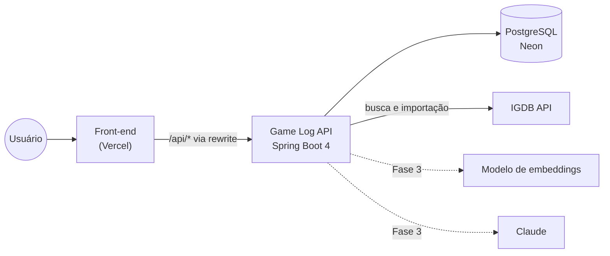
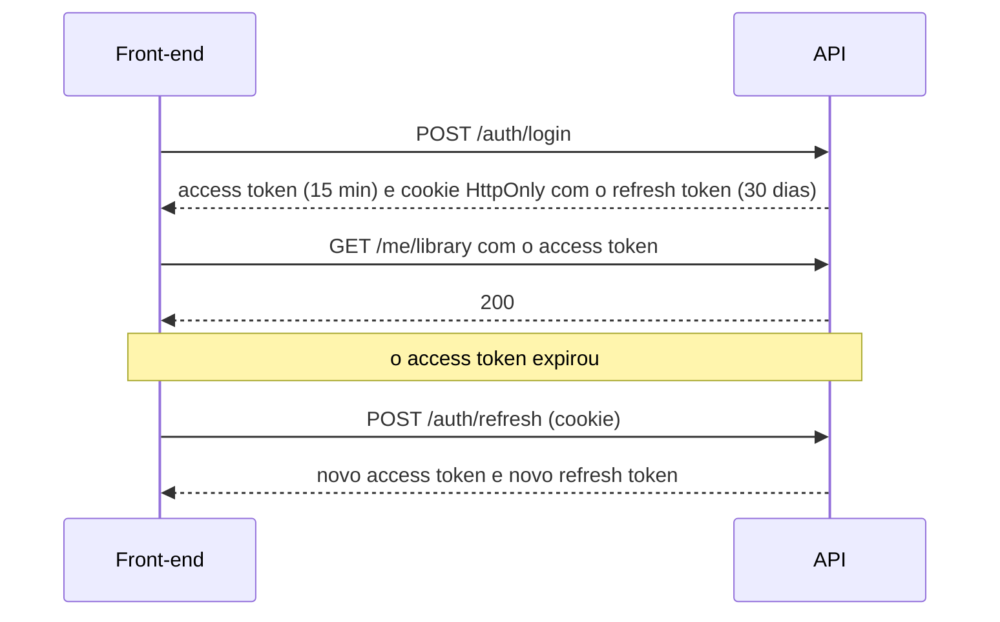

# 05 · Arquitetura

## Visão geral



É um **monólito modular**: um único deploy, com o código separado por funcionalidade. Para o tamanho do projeto, é o que dá menos trabalho para operar. Como os módulos ficam bem separados, dá para extrair algum deles depois, se um dia fizer sentido.

## Stack

| Camada | Escolha | Por quê |
|---|---|---|
| Linguagem | Java 25 (LTS) | LTS mais recente; o projeto já é Java ([D1](README.md#decisões)) |
| Framework | Spring Boot 4.1 (Spring Framework 7) | A linha 3.5 saiu do suporte gratuito em 30/06/2026, e o Spring AI 2.0 exige o Boot 4 |
| Web | Spring MVC com virtual threads | Modelo simples; as virtual threads ajudam nas chamadas ao IGDB |
| Persistência | Spring Data JPA (Hibernate 7) + PostgreSQL 18 (mesma versão do Neon) | `pg_trgm` para a busca, `jsonb` para metadados, `pgvector` na Fase 3 |
| Migrations | Flyway | Schema versionado e revisável em PR |
| Segurança | Spring Security 7 + OAuth2 Resource Server (JWT) | Validação de JWT pronta, sem biblioteca extra |
| Validação | Jakarta Bean Validation | Anotações nos DTOs de entrada |
| HTTP externo | `RestClient` | Cliente do IGDB, com limite de taxa e retry |
| Cache | Spring Cache + Caffeine | Listas auxiliares e respostas do IGDB. Redis só se houver mais de uma instância |
| Documentação | springdoc-openapi | Swagger UI gerado do código |
| Testes | JUnit, AssertJ, Mockito, Testcontainers, WireMock | Banco real nos testes e IGDB simulado |
| Qualidade | Spotless, JaCoCo, Dependabot, CodeQL | Formatação, cobertura e alertas de segurança automáticos |
| IA (Fase 3) | Spring AI 2.0 + pgvector | Embeddings, busca vetorial e chamadas ao Claude |

## Organização do código

Pacotes por funcionalidade, não por tipo (nada de `controllers/` e `services/` na raiz):

```text
src/main/java/com/kauan/gamelog/
├── GameLogApplication.java
├── shared/          configuração, segurança, erros (Problem Details), paginação
├── auth/            cadastro, login, tokens
├── user/            perfil e configurações da conta
├── catalog/         jogos, gêneros, plataformas, lojas, busca
│   └── igdb/        cliente e importação do IGDB
├── library/         entradas da biblioteca e regras por status
├── profile/         leitura pública: abas e estatísticas
├── social/          (Fase 2) seguir, feed, curtidas, denúncias
├── lists/           (Fase 2) listas personalizadas
└── recommendation/  (Fase 3) embeddings e sugestões
```

Dentro de cada módulo, comece simples e só divida quando crescer:

```text
library/
├── LibraryController.java       rotas /me/library
├── LibraryService.java          casos de uso e regras
├── LibraryEntry.java            entidade
├── Review.java                  @Embeddable
├── Playthrough.java             @Embeddable
├── Acquisition.java             @Embeddable
├── EntryStatus.java             enum
├── LibraryEntryRepository.java
└── dto/                         records de entrada e saída
```

Regras:

- O controller só traduz HTTP ↔ DTO e chama o service.
- A entidade nunca sai do service: a resposta é sempre um record.
- Um módulo não usa o repositório de outro. Ele chama o service público do outro módulo ou reage a um evento. Quando o módulo de baixo precisa de algo do de cima, ele declara uma interface e o de cima a implementa: os números da comunidade aparecem no catálogo pela interface `GameCommunity`, implementada pela biblioteca.
- Formato de entrada é validado nos DTOs (Bean Validation); regra de negócio fica no domínio.
- Injeção sempre pelo construtor.
- (Opcional) Um teste com Spring Modulith verifica que os módulos não acessam o interior uns dos outros.

### Eventos internos

| Evento | Publicado por | Quem ouve |
|---|---|---|
| `LibraryEntryChanged` | `library` | `social` (feed, Fase 2), `profile` (cache das estatísticas), `recommendation` (gosto do usuário, Fase 3) |
| `GameImported` / `GameUpdated` | `catalog` | `recommendation` (reindexar o embedding, Fase 3) |

Use `ApplicationEventPublisher` com `@TransactionalEventListener(phase = AFTER_COMMIT)`. Se for preciso garantir a entrega mesmo com a aplicação caindo, o Spring Modulith guarda os eventos numa tabela (padrão outbox).

## Segurança



- **Senhas:** BCrypt com custo 12.
- **Access token:** JWT assinado (RS256) com validade de 15 minutos, contendo `sub` (id do usuário), `username` e papéis (`roles`). No front, fica só em memória. A própria API assina e valida (Spring Security Resource Server), sem servidor de autorização separado.
- **Refresh token:** valor aleatório, salvo no banco só como hash SHA-256, com validade de 30 dias e trocado a cada uso. Se um refresh já usado aparecer de novo, a sessão inteira (a "família") é revogada, porque isso indica roubo do token.
- **Cookie:** `HttpOnly; Secure; SameSite=Lax; Path=/api/v1/auth`. Para o cookie funcionar, front e API precisam estar no mesmo site: use o rewrite do Vercel (`/api/*` → API) ou subdomínios de um mesmo domínio. O Safari bloqueia cookies de terceiros.
- **Autorização:** a escrita acontece sempre em `/me/...`, então não existe id de outro usuário para trocar na URL (sem IDOR). As rotas de admin exigem `hasRole('ADMIN')`.
- **CORS:** origens lidas de `CORS_ORIGINS`.
- **Limite de requisições:** login, cadastro, refresh e buscas que chegam ao IGDB (com Bucket4j ou um filtro próprio).
- **Avaliações:** o texto é puro, e o front nunca o renderiza como HTML (evita XSS).
- **Segredos:** só em variáveis de ambiente; `.env` no `.gitignore` e um `.env.example` versionado.

## Integração com o IGDB

- **Credenciais:** crie um app no console de desenvolvedor da Twitch (Client ID + Client Secret) e obtenha o token por *client credentials* em `POST https://id.twitch.tv/oauth2/token`. O token vale por semanas: guarde em memória e renove quando expirar ou quando a API responder 401.
- **Chamadas:** `POST https://api.igdb.com/v4/games`, com os headers `Client-ID` e `Authorization: Bearer`. O corpo vai na linguagem Apicalypse (campos, filtros, limite).
- **Limite:** 4 requisições por segundo por credencial. O cliente espaça as chamadas, lembra por 24 h as buscas já feitas e repete com espera (`RetryTemplate` do Spring Framework 7) os erros temporários: 401, 429 e 5xx. Timeout e erro de rede não repetem, para a busca não travar.
- **O que importar:** jogos principais, remakes, remasters e expansões; ficam de fora DLCs pequenas e bundles.
- **Campos:** nome, slug, resumo, lançamento, capa, gêneros, plataformas, temas, palavras-chave, modos, perspectiva, desenvolvedora, publicadora, franquia, nota, número de avaliações e `similar_games`.
- **Capas:** guarde só o `image_id` e monte a URL no tamanho desejado: `https://images.igdb.com/igdb/image/upload/t_cover_big/{image_id}.jpg`.
- **Isolamento:** tudo do IGDB fica em `catalog/igdb`. O resto do sistema lê o catálogo local e só chama `IgdbCatalogSync`, então trocar pelo RAWG fica restrito a esse pacote.
- **Estratégia:**
  1. um job inicial importa os jogos mais populares (`--game-log.igdb.bootstrap-limit=2000`);
  2. a busca usa o IGDB como fallback quando o resultado local é fraco;
  3. uma ressincronização periódica (ex.: semanal) atualiza os jogos com `synced_at` antigo.
- **Termos:** o uso segue o Twitch Developer Services Agreement; dê crédito ao IGDB no rodapé do front.

## Busca

A coluna `title_normalized` (minúsculas, sem acento) é preenchida na gravação e tem um índice GIN com `gin_trgm_ops`. A consulta usa similaridade de trigramas e ordena por semelhança e popularidade. Assim, "witcher 3" encontra "The Witcher 3: Wild Hunt" e "pokemon" encontra "Pokémon".

## Testes

| Tipo | Ferramenta | O que cobre |
|---|---|---|
| Unidade | JUnit + AssertJ + Mockito | Regras da RN02 (teste parametrizado por status), estatísticas, mapeamentos |
| Web | `@WebMvcTest` + `MockMvcTester` | Validação, status HTTP, formato de erro, 401/403 |
| Persistência | `@DataJpaTest` + Testcontainers | Consultas com filtros, estatísticas, constraints |
| Integração | `@SpringBootTest` + Testcontainers | Fluxos completos: cadastro → login → adicionar jogo → perfil público |
| Cliente externo | WireMock | IGDB: token expirado, 429, timeout, resposta inesperada |
| Arquitetura | Spring Modulith ou ArchUnit | Módulos sem acesso indevido entre si |

Os testes rodam contra a mesma imagem de PostgreSQL usada em desenvolvimento, sem H2. O H2 não tem `pg_trgm`, `jsonb` nem `pgvector`.

## Ambientes e configuração

| Perfil | Banco | Uso |
|---|---|---|
| `local` (padrão) | PostgreSQL do `compose.yaml` na porta 5433 (o Spring Boot sobe o container junto com a aplicação) + seed de exemplo em `db/seed` | desenvolvimento |
| testes (`./mvnw verify`) | PostgreSQL 18 em container (Testcontainers com `@ServiceConnection`), compartilhado entre as classes de teste | testes automatizados |
| `prod` | Neon, via `SPRING_DATASOURCE_*` (exige `SPRING_PROFILES_ACTIVE=prod`) | produção |

| Variável | Exemplo | Uso |
|---|---|---|
| `SPRING_PROFILES_ACTIVE` | `local` / `prod` | perfil |
| `SPRING_DATASOURCE_URL` | `jdbc:postgresql://localhost:5432/gamelog` | banco |
| `SPRING_DATASOURCE_USERNAME` / `SPRING_DATASOURCE_PASSWORD` | | banco |
| `JWT_PRIVATE_KEY` | PEM (PKCS#8) | assinatura dos tokens; a chave pública é derivada dela. Obrigatória em `prod`; sem ela, o perfil local gera uma chave a cada subida |
| `CORS_ORIGINS` | `http://localhost:5173` | origens liberadas, separadas por vírgula |
| `IGDB_CLIENT_ID` / `IGDB_CLIENT_SECRET` | | app da Twitch |
| `ANTHROPIC_API_KEY`, chave do provedor de embeddings | | Fase 3 |

As variáveis `SPRING_DATASOURCE_*` são lidas pelo Spring sem nenhuma linha no `application.properties`.

## CI/CD

```text
PR aberto     → ./mvnw verify (formatação, testes com Testcontainers, cobertura) → status no PR
merge na main → build da imagem → publica no GHCR → deploy (Render ou Cloud Run)
```

- A imagem pode sair do Buildpacks (`./mvnw spring-boot:build-image`, sem Dockerfile) ou de um Dockerfile multi-stage.
- Dependabot para Maven e GitHub Actions; CodeQL (gratuito em repositório público).
- No plano gratuito do Render, a aplicação hiberna quando fica sem uso, e a primeira requisição depois disso demora. O Cloud Run escala a zero e costuma acordar mais rápido. Se incomodar, a Fase 4 tem a opção de AOT cache ou imagem nativa.

## Observabilidade

- `/actuator/health` com liveness, readiness e banco.
- Em produção, logs estruturados em JSON (suporte nativo do Spring Boot), com traceId por requisição.
- Métricas do Micrometer: latência por rota, chamadas ao IGDB, taxa de acerto do cache. Exportar para Prometheus ou Grafana Cloud na Fase 2, se quiser.

## Desempenho

- `spring.jpa.open-in-view=false` (já está assim) e consultas com projeções ou `JOIN FETCH` para evitar N+1.
- Paginação sempre no banco.
- Listas auxiliares (gêneros, plataformas, lojas) em cache.
- Números da comunidade calculados na consulta no MVP e pré-calculados na Fase 2, quando o volume justificar.
