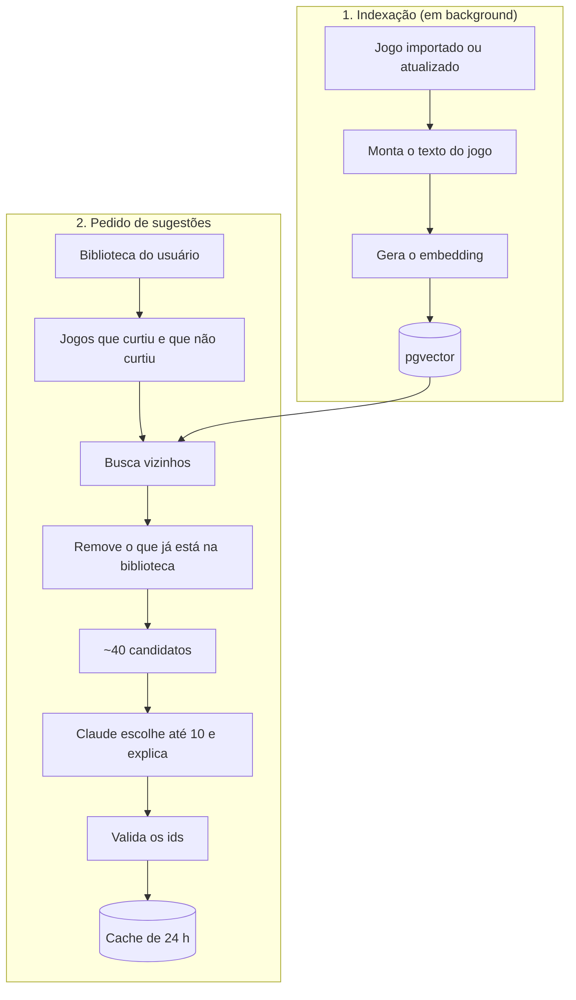

# 06 · Recomendações com IA

> Fase 3. Nada daqui precisa ser construído agora, mas o MVP já precisa **guardar os dados certos** (ver o checklist no fim).

## O que vamos entregar

| Funcionalidade | Como funciona | Usa LLM? |
|---|---|---|
| Jogos parecidos (página do jogo) | Vizinhos mais próximos do jogo no espaço de embeddings | Não |
| Você poderá gostar (só busca) | Vizinhos dos jogos que o usuário curtiu, menos o que ele já tem | Não |
| Você poderá gostar (RAG) | A busca acima gera candidatos; o Claude escolhe os melhores e explica o motivo | Sim |
| Busca em linguagem natural (opcional) | "terror curto para jogar em dupla" vira um embedding e é buscado no catálogo | Opcional |

Cada etapa funciona sozinha e já entrega valor. A versão com LLM é uma camada em cima da busca, não um substituto dela.

## Por que RAG, e não perguntar direto ao modelo

Se pedirmos ao modelo "recomende jogos parecidos com Hollow Knight", ele pode citar jogos que não estão no nosso catálogo ou errar nomes. Com RAG:

1. **Recuperação:** buscamos no **nosso** banco os candidatos mais próximos do gosto do usuário.
2. **Aumento:** colocamos esses candidatos, junto com o histórico do usuário, no prompt.
3. **Geração:** o modelo escolhe **só entre os candidatos** e escreve o motivo de cada um.

Assim, toda sugestão tem página no site, e o modelo fica com a parte que faz bem: ponderar o gosto e explicar a escolha.

## Fluxo



## 1. Indexação dos jogos

Para cada jogo, montamos um texto e geramos um embedding, um vetor que representa o "assunto" do texto:

```text
Hollow Knight (2017). Genres: Adventure, Indie, Platform. Themes: Action, Fantasy. Keywords: metroidvania, ...
Modes: Single player. Perspective: Side view. Developer: Team Cherry. Series: Hollow Knight.
Summary: Forge your own path in Hollow Knight! An epic action adventure through a vast ruined kingdom...
```

O texto fica em inglês, como os dados do IGDB e o modelo, com o que mais diz sobre o jogo primeiro: o modelo lê até 256 tokens, então o resumo vai por último e cortado em 600 caracteres.

- O vetor fica no próprio PostgreSQL, com **pgvector** (o Neon suporta), índice HNSW e distância de cosseno.
- Junto com o vetor, guardamos o **hash do texto** e o **nome do modelo**. Só recalculamos quando o texto muda. Trocar de modelo exige reindexar tudo, porque vetores de modelos diferentes não se comparam.
- A indexação roda numa thread só, em lotes de 32, para não disputar a CPU com as requisições. Na subida, um passe confere o catálogo inteiro pelo hash; depois, cada `GameImported` (jogo novo ou atualizado pelo IGDB) entra na fila.
- Custo: com o modelo local, nenhum por chamada; com um provedor gerenciado, indexar ~10 mil jogos sai por centavos de dólar.

A Anthropic não tem modelo de embeddings próprio. As opções:

| Opção | Prós | Contras |
|---|---|---|
| Voyage AI | Indicada pela Anthropic; boa qualidade | Mais uma conta e uma chave de API |
| OpenAI `text-embedding-3-small` | Barata e muito usada | Mais uma conta e uma chave de API |
| Modelo local com Ollama (ex.: `nomic-embed-text`) | Grátis e ótimo para desenvolvimento | Em produção, é preciso hospedar o modelo |

| Modelo dentro da API (Spring AI Transformers, all-MiniLM-L6-v2) | Grátis, sem conta e sem serviço à parte | Qualidade menor; mais memória e CPU no servidor; a primeira subida baixa o modelo e a biblioteca nativa do PyTorch |

**Por enquanto, só para teste:** o all-MiniLM-L6-v2 (384 dimensões) roda dentro da API, pelo Spring AI, e só no perfil local. Em produção, os embeddings ficam desligados (`spring.ai.model.embedding=none`) até a escolha do provedor. Trocar é mudar a dependência e a configuração, com uma migration para a nova dimensão e uma reindexação.

## 2. Sinais do usuário

| Sinal | Efeito |
|---|---|
| Favorito | peso 3 |
| Nota de 4,5 a 5 | peso 2 |
| Nota de 3,5 a 4,25 | peso 1 |
| Recomenda = sim | +1 |
| Nota até 2 ou recomenda = não | sinal negativo: afasta candidatos muito parecidos |
| "Não tenho interesse" numa sugestão | exclui o jogo das próximas sugestões |
| Lista de desejos e Quero jogar | mostram interesse; não são sugeridos (já estão na biblioteca), mas ajudam a entender o gosto |

Os pesos são um ponto de partida. A avaliação (mais abaixo) mostra se funcionam.

## 3. Recuperação dos candidatos

Há duas formas de buscar:

- **Centroide:** média ponderada dos vetores dos jogos curtidos e busca pelos vizinhos dessa média. É simples, mas quem gosta de terror **e** de jogo de fazenda vira uma média que não representa nenhum dos dois.
- **Vários vetores (recomendado):** busca os vizinhos de cada um dos ~10 jogos mais bem avaliados e junta as listas com *Reciprocal Rank Fusion*. Respeita gostos variados.

Depois da busca:

- tira o que já está na biblioteca e o que foi marcado como "não tenho interesse";
- tira DLCs e jogos não lançados;
- limita a 2 jogos por franquia, para não sugerir cinco Final Fantasy;
- (opcional) dá preferência às plataformas que o usuário usa.

Sobram cerca de 40 candidatos.

## 4. Geração com o Claude

O prompt leva:

- os jogos que o usuário mais curtiu (título, nota, se recomenda e trechos das avaliações **dele**);
- os jogos que ele não curtiu;
- os ~40 candidatos (id, título, gêneros, temas e um resumo curto).

O pedido: escolher até 10 candidatos, em ordem, cada um com um motivo de uma frase que cite jogos do usuário.

A resposta vem em JSON por **saída estruturada**: o schema vai na requisição, então o JSON sempre chega válido.

```json
{
  "recommendations": [
    { "gameId": 1942, "reason": "Exploração e combate desafiador, como em Hollow Knight, que você favoritou." }
  ]
}
```

Cuidados:

- **Validar os ids:** descartar qualquer `gameId` que não esteja entre os candidatos.
- **Fallback:** se a chamada falhar ou a IA estiver desligada, devolver a lista da busca com um motivo por template ("Parecido com X, que você favoritou"). A seção nunca quebra.
- **Prompt injection:** o texto das avaliações é escrito pelo usuário. Por isso, entra só o texto do próprio usuário (no máximo ele afetaria as próprias sugestões), marcado como dado. A validação dos ids impede sugerir algo fora do catálogo.
- **Privacidade:** nada de e-mail, username ou gênero no prompt. O gênero também não entra no cálculo das sugestões, para não gerar recomendação por estereótipo ([RN14](01-requisitos.md#regras-de-negócio)). A política de privacidade deve informar que as avaliações podem ser processadas por um provedor de IA, e o usuário deve poder desligar a personalização.

## Modelo e custo

- Modelo padrão: **Claude Opus 5.5** (`claude-opus-5-5`), a US$ 4 por milhão de tokens de entrada e US$ 20 por milhão de saída.
- Estimativa por geração: ~5 mil tokens de entrada e 1 a 2 mil de saída (incluindo o raciocínio do modelo), o que dá **US$ 0,04 a 0,06**.
- Para controlar o custo:
  - guardar as sugestões por até 24 h e só gerar de novo se a biblioteca mudou;
  - gerar só quando o usuário abre a seção, não para todo mundo;
  - se um dia as sugestões forem geradas em lote durante a noite, a **Batch API** cobra metade;
  - *prompt caching* só compensa se a parte fixa do prompt (instruções + schema) ficar grande.
- Modelos mais baratos (Claude Sonnet 5.5 ou Haiku 4.5) talvez deem conta desse caso. A troca é decisão sua; para decidir, compare as sugestões dos dois modelos nos mesmos usuários de teste.

## Usuário novo (cold start)

Com menos de 3 jogos curtidos, não há sinal suficiente. As opções, em ordem:

1. A tela "Escolha 5 jogos que você ama", logo após o cadastro.
2. O `similar_games` do IGDB, a partir dos poucos jogos que ele já tem.
3. Os populares nos gêneros que ele escolher.

## Como saber se está bom

**Antes de lançar (offline):** para cada usuário de teste, esconda 1 ou 2 jogos que ele curtiu e veja se eles aparecem no top 10 sugerido (**Recall@10**). Compare cinco abordagens:

1. populares (linha de base);
2. `similar_games` do IGDB;
3. centroide;
4. vários vetores;
5. vários vetores + Claude.

**Depois de lançar (online):** % de sugestões clicadas, % adicionadas à biblioteca e % marcadas como "não tenho interesse".

## Tecnologia

- **Spring AI 2.0** (GA em junho de 2026, exige Spring Boot 4): `EmbeddingModel` (hoje, o modelo local) e `ChatClient` com o Claude, convertendo a saída direto para records Java. A tabela dos vetores é nossa, sem o `VectorStore`: o jogo é a chave, e a busca precisa de filtros.
- A busca de candidatos é nossa (SQL com pgvector e filtros), e não o *advisor* genérico de perguntas e respostas, porque aqui a "pergunta" é o perfil do usuário.
- Para a geração, uma alternativa é o SDK oficial da Anthropic para Java (`anthropic-java`).

## O que o MVP já precisa fazer

- [x] Guardar os metadados ricos do IGDB em `games.metadata`: temas, palavras-chave, modos, perspectiva, desenvolvedora, franquia, série, jogo principal e `similar_games`.
- [x] Importar milhares de jogos populares, não só os que os usuários adicionam. A IA precisa de candidatos.
- [x] Publicar os eventos `LibraryEntryChanged` e `GameImported` (este vale para jogo novo e atualizado), mesmo sem ninguém ouvindo ainda.
- [x] Usar a imagem do PostgreSQL com pgvector desde a Fase 0.
- [x] Manter a escala de nota estável (0 a 5, em passos de 0,25).
